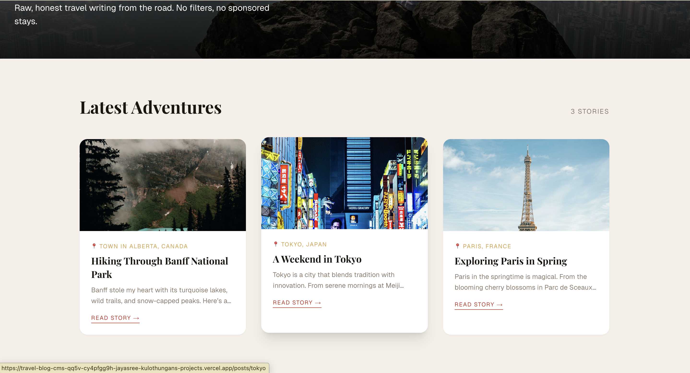
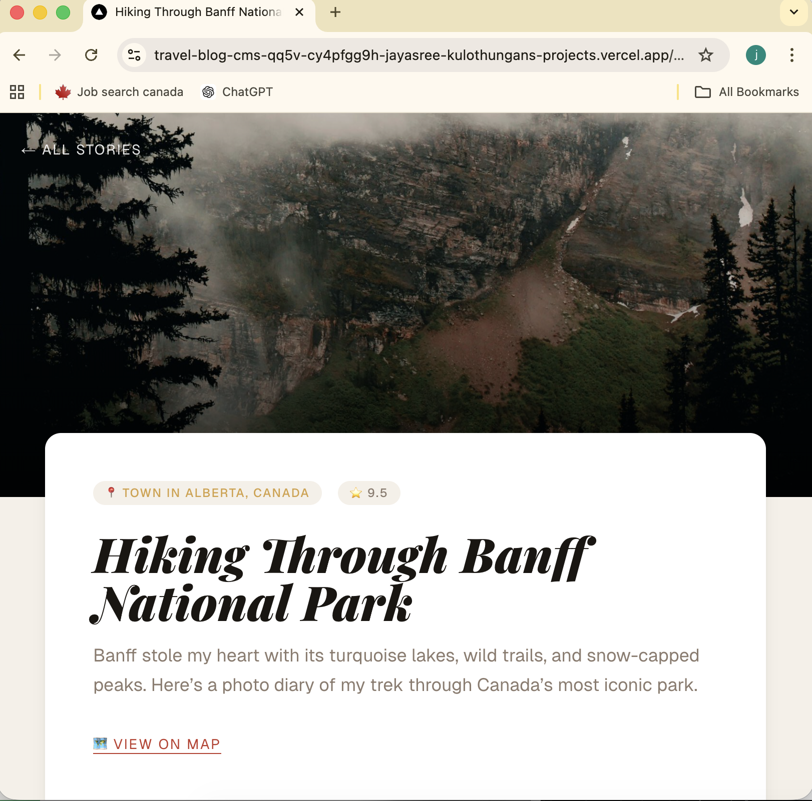
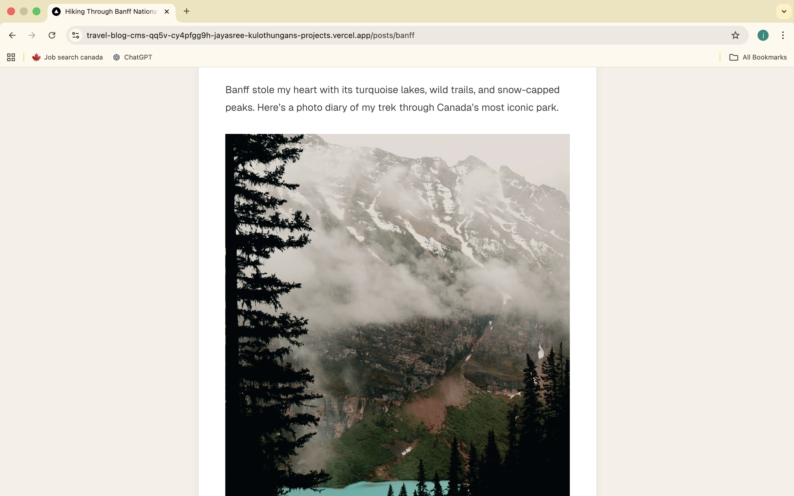
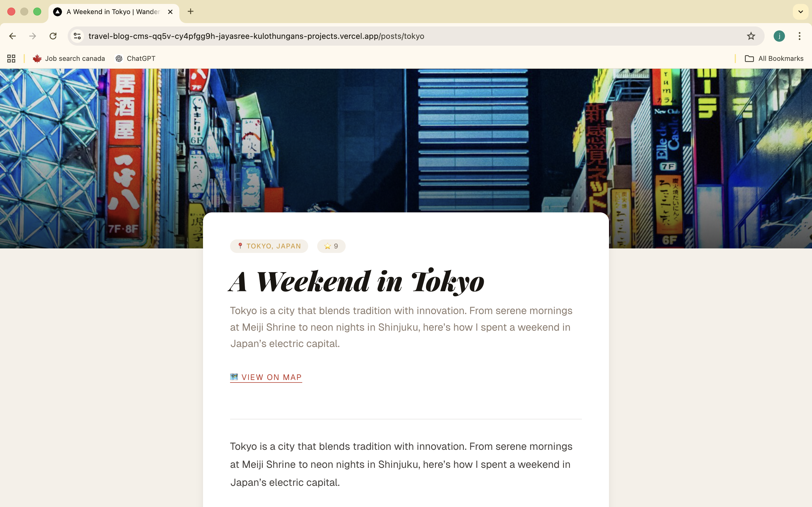
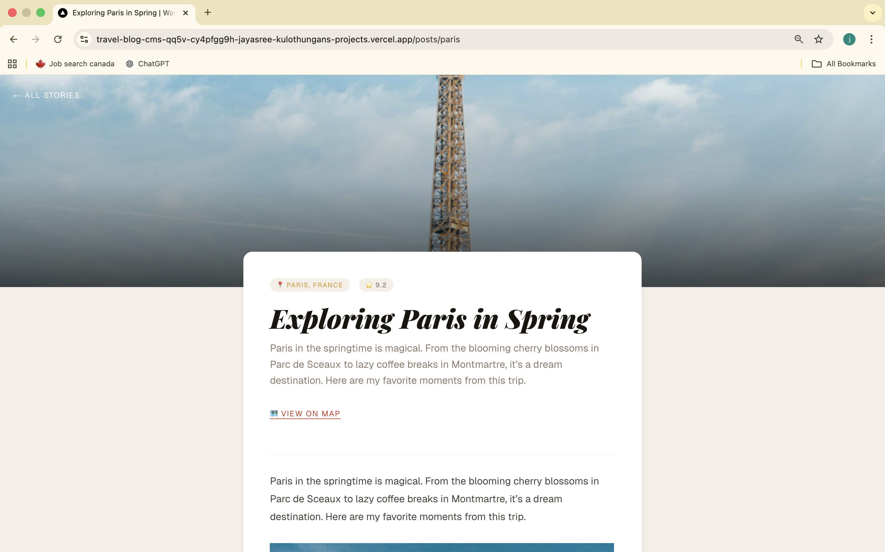

# Wanderlust Chronicles — Headless Travel Blog

A headless travel blog built with **WordPress** (CMS/GraphQL API) + **Next.js 15** (frontend) + **Apollo Client** + **Tailwind CSS**.

## Tech Stack

| Layer         | Technology                                  |
| ------------- | ------------------------------------------- |
| CMS           | WordPress 6.5 + WPGraphQL plugin            |
| Frontend      | Next.js 15 (App Router)                     |
| Data fetching | Apollo Client (server-side, ISR)            |
| Styling       | Tailwind CSS v3 + `@tailwindcss/typography` |
| Type safety   | GraphQL Code Generator                      |
| Animations    | AOS (Animate on Scroll)                     |

## Getting Started

### 1. WordPress setup

- Install WordPress locally (e.g. with [Local](https://localwp.com/))
- Install and activate the **WPGraphQL** plugin
- Install **Advanced Custom Fields (ACF)** + **WPGraphQL for ACF** for post metadata fields
- Add custom ACF fields: `location` (Text), `tripRating` (Text), `mapLink` (URL) on Posts

### 2. Next.js setup

```bash
npm install
cp .env.local.example .env.local
# Edit .env.local and set your WordPress GraphQL endpoint
npm run dev
```

### 3. Environment variables

```bash
# .env.local
NEXT_PUBLIC_WORDPRESS_GRAPHQL_ENDPOINT=http://your-wp-site.local/graphql
```

### 4. Regenerate GraphQL types

After changing any `.graphql` query files:

```bash
npm run codegen
```

## Project Structure

```
src/
├── app/
│   ├── page.tsx                  # Redirects / → /home
│   ├── layout.tsx                # Root layout, fonts, global metadata
│   ├── globals.css               # Tailwind + design tokens
│   ├── home/
│   │   └── page.tsx              # Homepage (Server Component, ISR)
│   └── posts/
│       └── [slug]/
│           ├── page.tsx          # Post detail page (Server Component, ISR)
│           ├── loading.tsx       # Skeleton loader
│           └── error.tsx         # Error boundary UI
├── components/
│   ├── AosInit.tsx               # Client-only AOS initialiser
│   └── BlogPostCard.tsx          # Reusable post card
├── graphql/
│   ├── fragments/postFragment.graphql
│   └── queries/
│       ├── GetAllPosts.graphql
│       └── GetPostBySlug.graphql
├── generated/
│   └── graphql.ts                # Auto-generated types (do not edit)
└── lib/
    └── apolloClient.ts           # Apollo Client singleton
```

## Docker

See the `Dockerfile` for a multi-stage Next.js production build and an example `docker-compose.yml` configuration that ties WordPress, MySQL, and Next.js together.

## Preview











